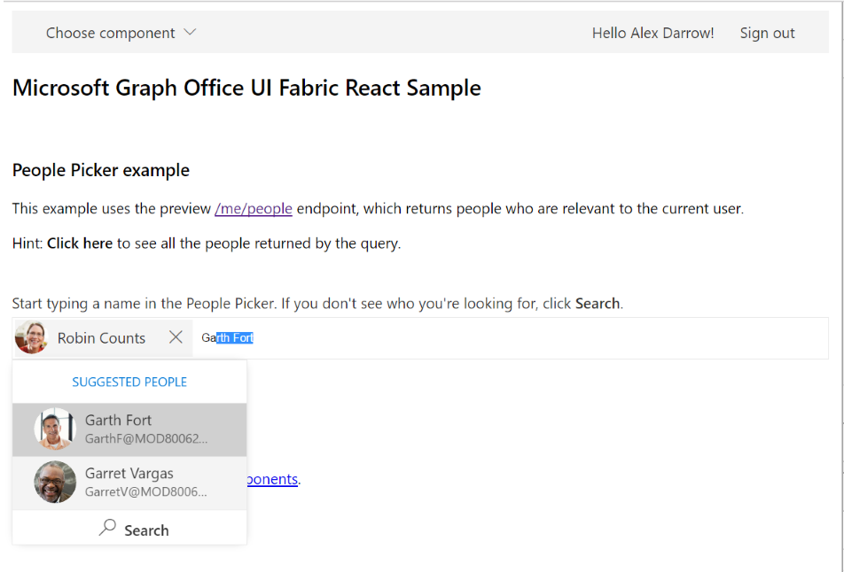

# Microsoft Graph Office UI Fabric React Sample

## Table of contents

* [Introduction](#introduction)
* [Prerequisites](#prerequisites)
* [Register the application](#register-the-application)
* [Build and run the sample](#build-and-run-the-sample)
* [Code of note](#code-of-note)
* [Questions and comments](#questions-and-comments)
* [Contributing](#contributing)
* [Additional resources](#additional-resources)

## Introduction

This sample is a simple React app that uses Microsoft Graph data with Office UI Fabric React (preview) components, primarily the [PeoplePicker](https://dev.office.com/fabric#/components/peoplepicker) and [DetailsList](https://dev.office.com/fabric#/components/detailslist) components.



The sample uses the [Microsoft Graph JavaScript Client Library](https://github.com/microsoftgraph/msgraph-sdk-javascript) to interact with Microsoft Graph, and [HelloJS](https://adodson.com/hello.js/) for authentication with the [Azure AD v2.0 endpoint](https://azure.microsoft.com/en-us/documentation/articles/active-directory-appmodel-v2-overview).

## Prerequisites

This sample requires the following:  

* [Node.js](https://nodejs.org/). Node is required to run the sample on a development server and to install dependencies.
* A [work or school account](https://dev.office.com/devprogram)
  
## Register the application

1. Navigate to the Azure portal [App registrations](https://go.microsoft.com/fwlink/?linkid=2083908) page.

2. Choose **New registration**.

3. When the **Register an application page** appears, enter your application's registration information:

    * In the **Name** section, enter the application name, for example `MyReactSample`
    * Change **Supported account types** to **Accounts in any organizational directory and personal Microsoft accounts (e.g. Skype, Xbox, Outlook.com)**.
    * In the Redirect URI (optional) section, select **Web** in the combo-box and enter the following redirect URI: `https://localhost:3000/`.

4. Select **Register** to create the application.

   The registration overview page displays, listing the properties of your app.

5. Copy the **Application (client) ID** and record it. This is the unique identifier for your app. You'll use this value to configure your app.

6. Select the **Authentication** section.
    * In the **Advanced settings** | **Implicit grant** section, check **Access tokens** and **ID tokens** as this sample requires
    the [Implicit grant flow](https://docs.microsoft.com/en-us/azure/active-directory/develop/v2-oauth2-implicit-grant-flow) to be enabled to
    sign in the user and call an API.

7. Select **Save**.

## Build and run the sample

1. Clone or download the Microsoft Graph Office UI Fabric React Sample.

2. Using your favorite IDE, open config.js in the *src/helpers* directory.

3. Replace the **applicationId** placeholder value with the application ID of your registered Azure application.

4. Open a command prompt in the sample's root directory, and run the following command to install project dependencies.

  ```
  npm install
  ```

5. After the dependencies are installed, run the following command to start the development server.

  ```
  npm start
  ```

6. Navigate to *http://localhost:3000* in your web browser.

7. Sign in with your work or school account.  

    >Note: Although the Azure AD v2.0 endpoint supports signing in with both personal and work or school accounts, this People Picker example uses features that are supported only with work or school accounts (such as the [`/me/people`](https://graph.microsoft.io/en-us/docs/api-reference/beta/api/user_list_people) endpoint).
  
8. In the command bar, choose **Choose component > People Picker** or **Choose component > Details List**.

   - In the People Picker example, you can filter your people list or search for users in your organization.
  
   - In the Details List example, you can select items from your list of files, filter items by name, or double-click and item to open it in OneDrive.

Next steps: Try adding more functionality or other components to this sample, or build your own simple app by following the [Office UI Fabric React tutorial](https://github.com/OfficeDev/office-ui-fabric-react/blob/master/ghdocs/README.md).

## Code of note

### Auth
This sample app uses [HelloJS](https://adodson.com/hello.js/) for authentication with the [Azure AD v2.0 endpoint](https://azure.microsoft.com/en-us/documentation/articles/active-directory-appmodel-v2-overview). 

 - [`App.js`](./App.js). Initializes a custom Azure AD auth network for HelloJS, and provides the login/logout methods.
 
 >Important! The app implements a very simple authentication model. It reuses the access token until the user signs out or until it receives a 401 'Access token has expired' error, at which time it redirects to the login method. Production apps should construct a more robust way of handling authentication and validation.

### Microsoft Graph interaction
This sample uses the [Microsoft Graph JavaScript Client Library](https://github.com/microsoftgraph/msgraph-sdk-javascript) (SDK) to interact with Microsoft Graph. 

 - [`GraphSdkHelper`](./src/helpers/GraphSdkHelper.js). Uses the SDK client to call Microsoft Graph and handle responses. 
 
 The client is initialized with an authProvider that gets the current access token to use for each request. The sample works with the [User](https://graph.microsoft.io/en-us/docs/api-reference/v1.0/resources/user), [Person](https://graph.microsoft.io/en-us/docs/api-reference/beta/resources/person) (preview), and [DriveItem](https://graph.microsoft.io/en-us/docs/api-reference/v1.0/resources/driveitem) APIs.

### Fabric components and styles
This sample uses several [Office UI Fabric React components](https://dev.office.com/fabric#/components) (preview). With Fabric's flexible development model, you can choose to rely on a component's default behavior or customize it to suit your needs.

 - [`App.js`](./App.js). Main app page that uses the **CommandBar** component to navigate examples and to choose to sign in/sign out.
 
 - [`PeoplePicker.js`](./src/component-examples/PeoplePicker.js). People Picker example that uses the **NormalPeoplePicker** component to display **Persona** components. Also uses components such as **Button** and **MessageBar**. 
 
 The sample's People Picker implementation works as follows:
   
   - When the PeoplePicker example loads, the sample sends a request to Microsoft Graph for the top 20 people who are relevant to the current user (first retrieving metadata and then retrieving profile photos). User metadata is mapped to **Persona** objects which are stored in the **_peopleList** array.
   
   - When text is entered into the picker, the **_onFilterChanged** method returns the matched results from the people list, which are then displayed as suggested people.
   
   - When the **Search** button is clicked, the **\_onGetMoreResults** method queries Microsoft Graph for the first 20 users whose name starts with the filter text. The results are temporarily added to the people array for use in the **\_onFilterChanged** method.
   
   - When people are selected or deselected, the **_onSelectionChanged** method updates a local array of selected people.
   
 - [`DetailsList.js`](./src/component-examples/DetailsList.js). Details List example that uses the **DetailsList** component with the **MarqueeSelection** and **Selection** utilities. Also uses components such as **Spinner** and **TextField**.

 The sample's Details List implementation works as follows:
   
   - When the DetailsList example loads, the sample sends a request to Microsoft Graph for the top 100 items in the current user's root drive. The drive item metadata is mapped to list item objects and stored in the **_items** array and saved to state. If the result set is paged, a null entry is added to the item array to trigger a request for the next page of results.
   
   - When filter text is entered into the text field, the **_onFilterChanged** method updates state with the matched results.
   
   - When list items are selected or deselected, the **_getSelectionDetails** method is invoked.
   
The sample also references the Office UI Fabric Core styles in [`index.html`](./public/index.html).

## Troubleshooting

| Issue | Resolution |
|:------|:------|
| Internal Server Errors for cached image queries in Microsoft Edge | If you refresh the browser while using the sample, you may receive HTTP 500 errors (Internal Server Error) for cached profile photo queries. A workaround is to close the sample tab, clear browser cache, and then reopen the sample. |  
| Syntax error in IE | The Microsoft Graph JavaScript Client Library uses ES6 promises. Related PR: [microsoftgraph/msgraph-sdk-javascript#29](https://github.com/microsoftgraph/msgraph-sdk-javascript/pull/29) |

## Questions and comments

We'd love to get your feedback about this sample. You can send us your questions and suggestions in the [Issues](https://github.com/microsoftgraph/react-officeuifabric-sample/issues) section of this repository.

Your feedback is important to us. Connect with us on [Stack Overflow](https://stackoverflow.com/questions/tagged/microsoftgraph). Tag your questions with [MicrosoftGraph].

## Contributing

If you'd like to contribute to this sample, see [CONTRIBUTING.md](CONTRIBUTING.md).

This project has adopted the [Microsoft Open Source Code of Conduct](https://opensource.microsoft.com/codeofconduct/). For more information see the [Code of Conduct FAQ](https://opensource.microsoft.com/codeofconduct/faq/) or contact [opencode@microsoft.com](mailto:opencode@microsoft.com) with any additional questions or comments.

## Additional resources

- [Office UI Fabric components](https://dev.office.com/fabric#/components)
- [Other Microsoft Graph samples](https://github.com/microsoftgraph?utf8=%E2%9C%93&q=sample)
- [Microsoft Graph overview](https://graph.microsoft.io)

## Copyright
Copyright (c) 2017 Microsoft. All rights reserved.